# echocity / ГдеСейчас — Fix-Everything Roadmap

> Executive companion to `implementation-backlog.md`. Reads top-down in five minutes.
> Backlog = **what** we ship (1,503 LOC across six sprints).
> Roadmap = **when**, **who**, and **in what order**.
>
> Owner: Filipp · Sole engineer-in-the-loop: Claude (via PowerShell + Windows-MCP)
> Baseline date: 2026-04-21 · Target v1 ship: 2026-05-26 (5 calendar weeks)

---

## 1. Where we are → where we're going

**Current state (2026-04-21)**

- 12-domain multi-turn review (Codex + Kimi critics, Claude-Opus defender, Claude-TL verdict) is **complete and locked** in `active-review.md` — 528,904 chars, zero RECOVERY GAPs.
- `implementation-backlog.md` is **synthesised**: P0.0 unblockers (U.1–U.13), Sprint A → F, LOC summary, risk register, scoreboard, ship checklist, parking lot.
- **Sprint A (Quality Gate Floor) — 13 of 14 tasks landed.** CI workflow, ESLint v9 flat, Husky v9, Playwright 1.58, typecheck, gitleaks, ErrorBoundary, instrumentation, YooKassa sandbox stub, smoke test, lint-staged all in tree. **Task #37 (branch protection) is the only A-gate still open** — user-action on GitHub.
- Pre-ship scoreboard: **2.2 / 5.0** across 12 domains. Post-Sprint-E projected: **3.5 / 5.0**. Post-Sprint-F: **4.2 / 5.0**.

**Target state (v1 ship — end of Week 5)**

- Yandex-indexable storefront on canonical host with JSON-LD, sitemap, OG.
- Financially integrity-bound checkout: IP-allowlisted YooKassa webhook, deterministic idempotence, `$transaction`-wrapped order state, append-only `FinancialEvent` ledger, 54-ФЗ receipt.
- Branded error / empty-state recovery surfaces; requestId correlation in logs.
- WCAG 2.1 AA baseline (contrast, 44×44 targets, keyboard traps audited); Metrika + GlitchTip observability; Timeweb VPS hot standby.
- Green CI gate on every PR; branch protection active; rollback plan documented.

**Stretch state (v1.1 — Sprint F waves, Weeks 6–9)**

- Seller onboarding UX, buyer notification channels, admin moderation tools, Turbo-страницы decision, cookie-consent UX, financial reporting dashboard.

---

## 2. Dependency DAG

```mermaid
flowchart LR
    subgraph P00 [P0.0 User Unblockers]
        U1[U.1 Canonical host]
        U2[U.2 Legal entity ИНН/ОГРН]
        U3[U.3 Telegram support handle]
        U4[U.4 Yandex/Google verification codes]
        U5[U.5 YooKassa sandbox keys]
        U6[U.6 Brand tone doc]
        U7[U.7 Staging environment]
        U8[U.8 Branch protection]
        U9[U.9 OG PNG master]
        U10[U.10 Observability stack pick]
    end

    subgraph A [Sprint A — Quality Gate Floor]
        A_done[CI + ESLint + Husky + Playwright + gitleaks + ErrorBoundary ✅]
        A37[Task #37 branch protection ⏳]
    end

    subgraph B [Sprint B — Financial Integrity]
        B1[Deterministic idempotence]
        B2[IP allowlist + HTTP Basic]
        B3[Upsert + $transaction]
        B4[P2002 handling + rawPayload scrub]
        B5[54-ФЗ receipt]
        B6[FinancialEvent ledger + AuditLog]
        B7[CronRun + advisory locks]
    end

    subgraph C [Sprint C — Operational Recovery]
        C1[Branded error pages]
        C2[Empty-state recovery]
        C3[requestId ALS]
        C4[Extended health check]
    end

    subgraph D [Sprint D — A11y + Perf + Security]
        D1[WCAG AA contrast + 44×44]
        D2[Metrika + GlitchTip]
        D3[Timeweb VPS hot standby]
        D4[CSRF narrowing]
    end

    subgraph E [Sprint E — SEO + Brand]
        E1[sitemap + robots]
        E2[metadata + JSON-LD]
        E3[OG PNG + verifications]
        E4[Footer legal entity]
    end

    subgraph F [Sprint F — Post-ship waves]
        F_all[F.a–F.g]
    end

    U8 --> A37
    A_done --> B
    A37 --> B
    U5 --> B1
    U5 --> B2
    U5 --> B5
    B --> C
    B --> D
    A_done --> C
    A_done --> D
    U10 --> D2
    U1 --> E1
    U1 --> E2
    U2 --> E4
    U4 --> E3
    U9 --> E3
    C --> Ship
    D --> Ship
    E --> Ship
    Ship([v1 SHIP — Week 5 Friday]) --> F
```



**Critical path:** `U.1 Canonical host → U.5 YooKassa keys → Sprint B → Sprint E → Ship`.
Every day `U.1` or `U.5` slips, the ship date slips by the same day.

---

## 3. Week-by-week calendar

| Week | Dates | Sprint | Primary work | Claude executes | User decides/acts | Exit criterion |
|---|---|---|---|---|---|---|
| **1** | Apr 21 – Apr 27 | A finish + B kickoff | Finish A.8 (branch protection). Unblock U.1, U.5. Start B.1–B.3. | B.1 deterministic idempotence, B.2 IP allowlist, B.3 upsert + `$transaction` | U.1 canonical host, U.5 YooKassa sandbox keys, U.8 branch protection (Task #37) | Webhook is IP-gated; unit tests green locally. |
| **2** | Apr 28 – May 04 | B finish | B.4–B.7 (P2002, rawPayload scrub, 54-ФЗ receipt, FinancialEvent ledger, CronRun + advisory locks). | All B code + migrations + tests. | U.2 legal entity ИНН/ОГРН (for receipts), U.7 staging env. | `pnpm test` covers payment success + replay + mismatch + duplicate; FinancialEvent rows appear for every state change. |
| **3** | May 05 – May 11 | C + D (parallel) | Branded error/empty states, requestId ALS, extended /api/health. WCAG AA contrast + 44×44 audit. | C.1–C.4 + D.1 + D.4 CSRF narrowing. | U.3 Telegram support handle (for error page CTA), U.6 brand tone doc (for empty-state copy). | Lighthouse a11y ≥ 95 on /, /city/[slug], /checkout. Synthetic 500 shows branded page with requestId. |
| **4** | May 12 – May 18 | D finish + E kickoff | Metrika + GlitchTip wiring, Timeweb VPS hot standby runbook. sitemap.xml, robots.txt, metadata, JSON-LD. | D.2, D.3, E.1, E.2. | U.10 observability stack confirm (Metrika + GlitchTip vs PostHog). U.4 Yandex/Google verification codes. | Metrika firing on all pages; GlitchTip catches synthetic exception; sitemap validates against Yandex Webmaster lint. |
| **5** | May 19 – May 26 | E finish + Ship | OG PNG master, footer legal entity, Webmaster verification. Full regression. Ship gate. | E.3, E.4, regression + smoke, staging → prod cutover runbook. | U.9 OG PNG master approved by brand. Final go/no-go. | All 8 ship-checklist items green. v1 live on canonical host. Rollback tested. |

Weeks 6–9 run Sprint F waves (F.a seller UX → F.g reporting). Cadence-only; not on critical path to v1.

---

## 4. Division of labour — what Claude does vs. what Filipp does

| Category | Items | Who | Channel |
|---|---|---|---|
| **Code (Sprint B–E)** | Every task in `implementation-backlog.md` under B.x, C.x, D.x (non-infra), E.x | **Claude** | PowerShell + Windows-MCP FileSystem; PRs via `git push` once branch protection is live |
| **Migrations** | Prisma `schema.prisma` + `prisma migrate dev` for FinancialEvent, AuditLog, CronRun, Idempotency | **Claude** | `npx prisma migrate dev --name <slug>` inside C:\dev\echocity |
| **Tests** | Vitest unit, Playwright e2e, webhook replay fixtures | **Claude** | `pnpm test`, `pnpm e2e` |
| **Observability wiring** | Metrika snippet, GlitchTip DSN, health-check envelope | **Claude** (after U.10) | Code + env vars |
| **Canonical host decision** (U.1) | Pick `gdesejchas.ru` vs. `vsedomatut.ru` vs. subdomain | **Filipp** | Reply in chat with final host |
| **Legal entity** (U.2) | ИНН, ОГРН, юр. адрес, КПП for footer + 54-ФЗ receipts | **Filipp** | Reply in chat with values |
| **Telegram support handle** (U.3) | `@...` that error pages link to | **Filipp** | Reply in chat |
| **Yandex + Google verification codes** (U.4) | HTML meta values from Webmaster / Search Console | **Filipp** | Paste codes in chat |
| **YooKassa sandbox keys** (U.5) | `shopId`, `secretKey`, optional HTTP Basic pair | **Filipp** | Paste into a local `.env.local` on C:\dev\echocity (Claude will NOT handle these) |
| **Brand tone doc** (U.6) | 1-page voice guide for empty-state + error copy | **Filipp** | Markdown in chat or `docs/brand-tone.md` |
| **Staging environment** (U.7) | Timeweb VPS / Vercel preview URL + env split | **Filipp** | Provisioning decision + credentials outside chat |
| **Branch protection** (U.8 / Task #37) | GitHub UI: require 1 review, all CI checks, linear history | **Filipp** | GitHub.com → Settings → Branches |
| **OG PNG master** (U.9) | 1200×630 brand asset | **Filipp** | Drop PNG into `public/og.png` |
| **Observability stack confirm** (U.10) | Metrika + GlitchTip vs alternative | **Filipp** | Reply in chat |

Rule of thumb: if it's a password, a key, a domain purchase, a legal number, or a UI toggle on a third-party dashboard — **Filipp**. Everything else is **Claude's** via PowerShell.

---

## 5. Next 7 days — concrete action list

**Filipp (today / tomorrow):**

1. Reply in chat with **U.1 canonical host** (one line, e.g. `gdesejchas.ru`).
2. Generate **U.5 YooKassa sandbox credentials** at yookassa.ru → drop into `C:\dev\echocity\.env.local` as `YOOKASSA_SHOP_ID`, `YOOKASSA_SECRET_KEY`.
3. Enable **branch protection** (Task #37) on `main`: require 1 review, all CI checks green, linear history, no force-push, no deletion.
4. Run locally to validate the ESLint v9 + Husky install from Sprint A:
   ```powershell
   cd C:\dev\echocity
   npm install
   npm run lint
   npm run typecheck
   ```
   Any failure → paste the output in chat, Claude fixes.

**Claude (starts immediately after U.5 lands):**

1. Sprint B.1 — deterministic idempotence key derivation + `Idempotency` table migration.
2. Sprint B.2 — IP allowlist middleware for `/api/webhooks/yookassa` with CIDR match against `185.71.76.0/27`, `185.71.77.0/27`, `77.75.153.0/25`, `77.75.154.128/25`, plus optional HTTP Basic fallback.
3. Sprint B.3 — wrap order state transition in `prisma.$transaction` + upsert pattern for webhook handler.
4. Vitest fixtures: happy path, replay, duplicate, signature mismatch, unknown event.

**Gate to end Week 1:** webhook is IP-gated, idempotent, transactional, and unit-tested locally. Staging deploy waits on U.7.

---

## 6. Risk register quickstrip (top 5)

| # | Risk | Likelihood | Impact | Mitigation owner |
|---|---|---|---|---|
| R.1 | U.1 / U.5 blockers slip past Week 1 | Medium | **Ship-blocking** | Filipp — resolve today |
| R.2 | YooKassa webhook double-credits an order | Low-after-B | Financial loss | Claude — B.1 + B.3 + B.6 |
| R.3 | Yandex rejects site for missing legal entity | Medium | SEO delay | Filipp — U.2 before Week 5 |
| R.4 | Branch protection disabled → force-push wipes history | Low | **Data loss** | Filipp — Task #37 today |
| R.5 | Contrast failures block a11y sign-off | Medium | Week-3 slip | Claude — D.1 audit + remediation |

Full 12-risk register lives in `implementation-backlog.md` §Risk Register.

---

## 7. Ship-gate checklist (copy from backlog, enforced at v1 cutover)

- [ ] All Sprint A–E tasks marked DONE with PRs merged
- [ ] `pnpm test` + `pnpm e2e` green on CI
- [ ] Lighthouse a11y ≥ 95 and perf ≥ 85 on /, /city/[slug], /checkout
- [ ] Yandex Webmaster verified; sitemap submitted; canonical host confirmed
- [ ] YooKassa production keys rotated in prod env; webhook IP-allowlisted; test payment end-to-end
- [ ] FinancialEvent ledger rows written for a real test order
- [ ] GlitchTip receiving errors from prod; Metrika receiving pageviews
- [ ] Rollback runbook rehearsed once (staging → last-known-good)

---

## 8. Reading order for anyone opening this folder cold

1. `ROADMAP.md` (this file) — why, when, who.
2. `implementation-backlog.md` — exact tasks + LOC + acceptance criteria.
3. `active-review.md` — the underlying 12-domain critique that generated both.

---

_Last updated: 2026-04-21. Next update: end of Week 1 (2026-04-27) — refresh calendar, risks, scoreboard._
